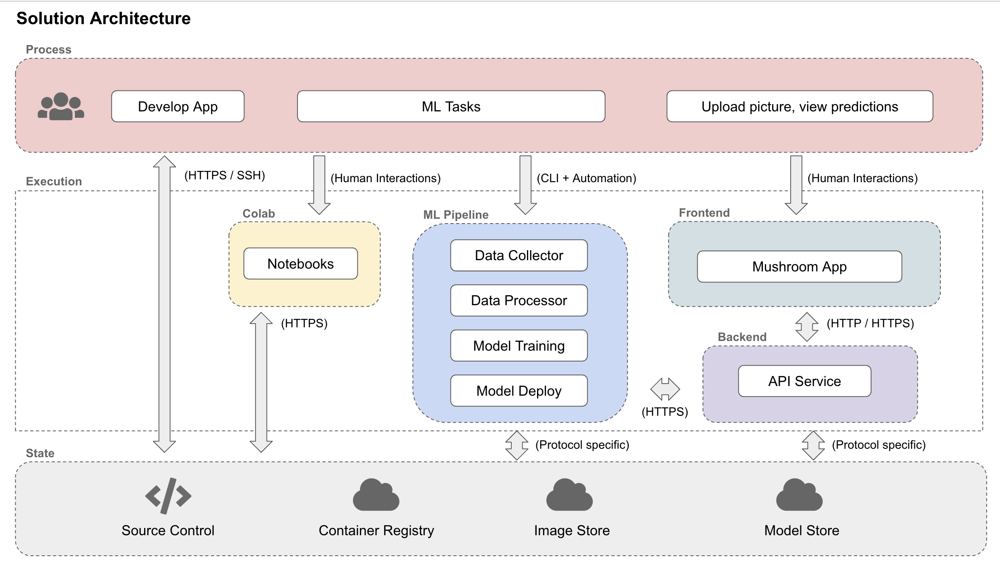
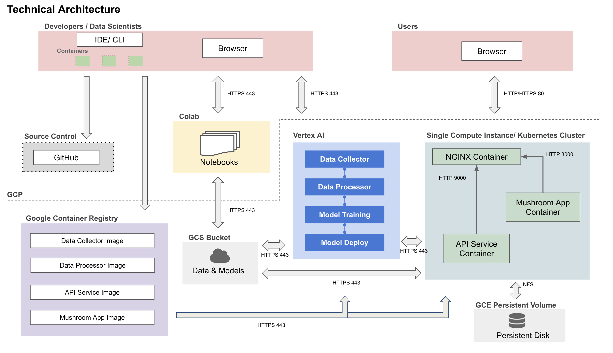
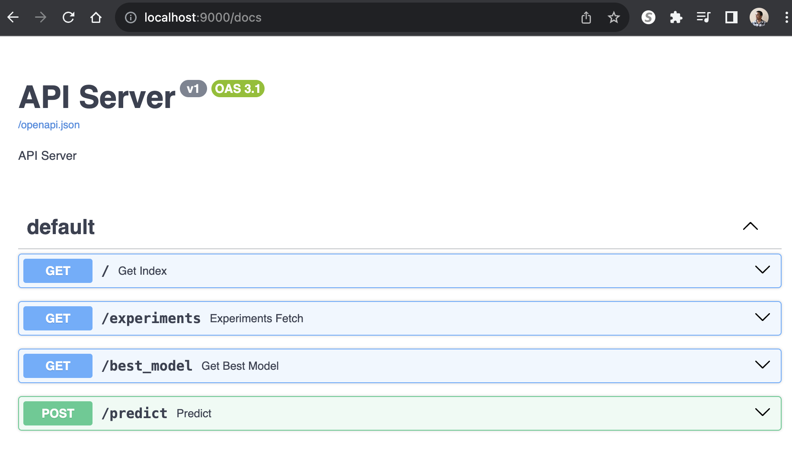
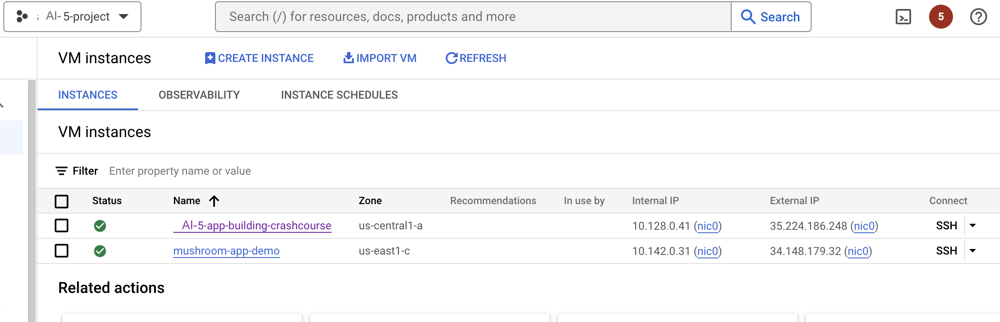

AI5-Template (Milestone 5)
==============================

AI5

Notes:

    The files are empty placeholders only
    Never commit large data files,trained models, personal API Keys/secrets to GitHub

Project Organization
------------

    .
    ├── data # DO NOT UPLOAD DATA
    │   ├── interim          <- Intermediate preprocessed data
    │   │   ├── test.csv
    │   │   ├── train.csv
    │   │   └── val.csv
    │   ├── processed        <- Final dataset files for modeling
    │   │   ├── file_00-0.tfrec
    │   │   ├── file_00-1.tfrec
    │   │   ├── file_00-2.tfrec
    │   │   └── file_00-3.tfrec
    │   └── raw              <- Original immutable input data
    │       └── training_data.zip
    ├── LICENSE
    ├── notebooks            <- Jupyter notebooks for EDA and model testing
    │   ├── eda.ipynb
    │   └── model_testing.ipynb
    ├── README.md
    ├── references           <- Reference materials such as papers
    ├── reports              <- Folder containing your milestone markdown submissions
    │   ├── milestone2.md
    │   └── milestone3.md
    │   └── milestone4.md
    │   └── milestone5.md
    ├── presentations        <- Folder containing your midterm presentation
    │   └── midterm.pdf
    ├── requirements.txt
    ├── src                    <- Source code and Dockerfiles for data processing and modeling
    │   ├── data-collector     <- Scripts for dataset creation
    │   │   ├── ...
    │   ├── data-processor     <- Code for data processing
    │   │   ├── ...
    │   └── model-training     <- Model training, evaluation, and prediction code
    │   │   ├── ...
    │   └── model-deploy       <- Model deployment
    │   │   ├── ...
    │   ├── workflow           <- Scripts for automating data collection, preprocessing, modeling
    │   │   ├── ...
    │   ├── api-service        <- Code for App backend APIs
    │   │   ├── api
    │   │   ├── Dockerfile
    │   │   ├── docker-entrypoint.sh
    │   │   ├── docker-shell.sh
    │   │   ├── Pipfile
    │   │   ├── Pipfile.lock
    │   ├── frontend            <- Code for App frontend
    │   │   ├── ...
    │   ├── deployment          <- Code for App deployment to GCP
    │   │   ├── deploy-create-instance.yml
    │   │   ├── deploy-docker-images.yml
    │   │   ├── deploy-provision-instance.yml
    │   │   ├── deploy-setup-containers.yml
    │   │   ├── deploy-setup-webserver.yml
    │   │   ├── inventory.yml
    │   │   ├── Dockerfile
    │   │   ├── docker-entrypoint.sh
    │   │   ├── docker-shell.sh
    
--------

# AI5 - Milestone5

**Team Members**
Pavlov Protovief, Paolo Primopadre and Pablo El Padron

**Group Name**
Awesome Group

**Project**
In this project we aim to develop an application that can identify various species of mushrooms in the wild using computer vision and offer educational content through a chatbot interface.

## Milestone 5

After completions of building a robust ML Pipeline in our previous milestone we have built a backend api service and frontend app. This will be our user-facing application that ties together the various components built in previous milestones.

**Application Design**

Before we start implementing the app we built a detailed design document outlining the application’s architecture. We built a Solution Architecture abd Technical Architecture to ensure all our components work together.

Here is our Solution Architecture:


Here is our Technical Architecture:



**Backend API**

We built backend api service using fast API to expose model functionality to the frontend. We also added apis that will help the frontend display some key information about the model and data. 



**Frontend**

A user friendly React app was built to identify various species of mushrooms in the wild using computer vision models from the backend. Using the app a user can take a picture of a mushroom and upload it. The app will send the image to the backend api to get prediction results on weather the mushroom is poisonous or not. 

Here are some screenshots of our app:


**Deployment**

We used Ansible to create, provision, and deploy our frontend and backend to GCP in an automated fashion. Ansible helps us manage infrastructure as code and this is very useful to keep track of our app infrastructure as code in GitHub. It helps use setup deployments in a very automated way.

Here is our deployed app on a single VM in GCP:



### Code Structure

The following are the folders from the previous milestones:
```
- data-collector
- data-processor
- model-training
- model-deploy
- workflow
```

**API Service Container**
This container has all the python files to run and expose thr backend apis.

To run the container locally:
- Open a terminal and go to the location where `awesome-app/src/api-service`
- Run `sh docker-shell.sh`
- Once inside the docker container run `uvicorn_server`
- To view and test APIs go to `http://localhost:9000/docs`

**Frontend Container**
This container contains all the files to develop and build a react app. There are dockerfiles for both development and production

To run the container locally:
- Open a terminal and go to the location where `awesome-app/src/frontend`
- Run `sh docker-shell.sh`
- If running the container for the first time, run `yarn install`
- Once inside the docker container run `yarn start`
- Go to `http://localhost:3000` to access the app locally


**Deployment Container**
This container helps manage building and deployeing all our app containers. The deployment is to GCP and all docker images go to GCR. 

To run the container locally:
- Open a terminal and go to the location where `awesome-app/src/deployment`
- Run `sh docker-shell.sh`
- Build and Push Docker Containers to GCR (Google Container Registry)
```
ansible-playbook deploy-docker-images.yml -i inventory.yml
```

- Create Compute Instance (VM) Server in GCP
```
ansible-playbook deploy-create-instance.yml -i inventory.yml --extra-vars cluster_state=present
```

- Provision Compute Instance in GCP
Install and setup all the required things for deployment.
```
ansible-playbook deploy-provision-instance.yml -i inventory.yml
```

- Setup Docker Containers in the  Compute Instance
```
ansible-playbook deploy-setup-containers.yml -i inventory.yml
```

- Setup Webserver on the Compute Instance
```
ansible-playbook deploy-setup-webserver.yml -i inventory.yml
```
Once the command runs go to `http://<External IP>/` 

---

## NOTE

**DO NOT KEEP YOUR GCP INSTANCES RUNNING**

Once you are done with taking screenshots for the milestone bring them down. 
