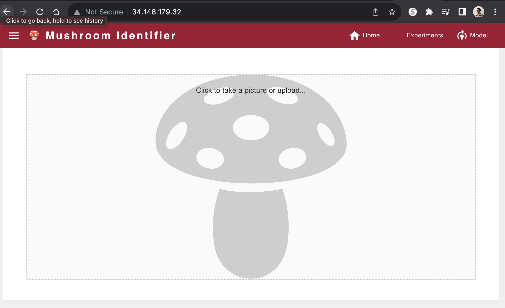
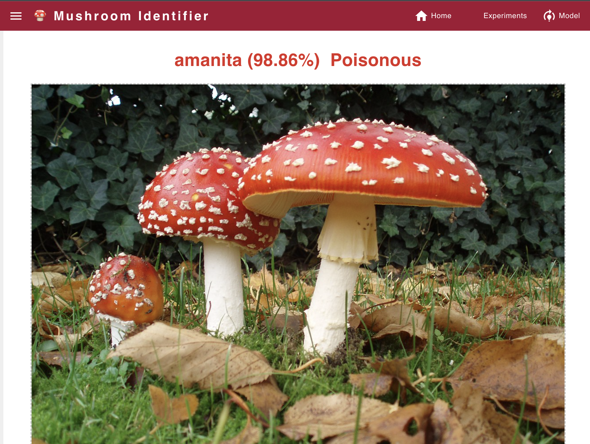
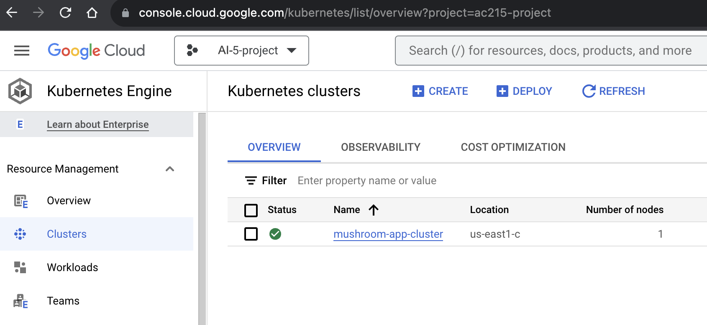

AI5 - \<Project Title>
==============================
### Presentation  Video
* \<Link Here>

### Blog Post Link
*  \<Link Here>
---


Notes:

    The files are empty placeholders only
    Never commit large data files,trained models, personal API Keys/secrets to GitHub

Project Organization
------------

    .
    ├── .github 
    │   ├── workflows         
    │   │   │   ├── cicdworkflow.yaml
    ├── data # DO NOT UPLOAD DATA
    │   ├── interim          <- Intermediate preprocessed data
    │   │   ├── test.csv
    │   │   ├── train.csv
    │   │   └── val.csv
    │   ├── processed        <- Final dataset files for modeling
    │   │   ├── file_00-0.tfrec
    │   │   ├── file_00-1.tfrec
    │   │   ├── file_00-2.tfrec
    │   │   └── file_00-3.tfrec
    │   └── raw              <- Original immutable input data
    │       └── training_data.zip
    ├── LICENSE
    ├── notebooks            <- Jupyter notebooks for EDA and model testing
    │   ├── eda.ipynb
    │   └── model_testing.ipynb
    ├── README.md
    ├── references           <- Reference materials such as papers
    ├── reports              <- Folder containing your milestone markdown submissions
    │   ├── milestone2.md
    │   └── milestone3.md
    │   └── milestone4.md
    │   └── milestone5.md
    ├── presentations        <- Folder containing your midterm presentation
    │   └── midterm.pdf
    ├── requirements.txt
    ├── src                    <- Source code and Dockerfiles for data processing and modeling
    │   ├── data-collector     <- Scripts for dataset creation
    │   │   ├── ...
    │   ├── data-processor     <- Code for data processing
    │   │   ├── ...
    │   └── model-training     <- Model training, evaluation, and prediction code
    │   │   ├── ...
    │   └── model-deploy       <- Model deployment
    │   │   ├── ...
    │   ├── workflow           <- Scripts for automating data collection, preprocessing, modeling
    │   │   ├── ...
    │   ├── api-service        <- Code for App backend APIs
    │   │   ├── ...
    │   ├── frontend            <- Code for App frontend
    │   │   ├── ...
    │   ├── deployment          <- Code for App deployment to GCP
    │   │   ├── deploy-create-instance.yml
    │   │   ├── deploy-docker-images.yml
    │   │   ├── deploy-provision-instance.yml
    │   │   ├── deploy-setup-containers.yml
    │   │   ├── deploy-setup-webserver.yml
    │   │   ├── deploy-k8s-cluster.yml
    │   │   ├── inventory.yml
    │   │   ├── Dockerfile
    │   │   ├── docker-entrypoint.sh
    │   │   ├── docker-shell.sh
    
--------

# AI5 - Final Project

**Team Members**
Pavlov Protovief, Paolo Primopadre and Pablo El Padron

**Group Name**
Awesome Group

**Project - Problem Definition**
In this project we aim to develop an application that can identify various species of mushrooms in the wild using computer vision and offer educational content through a chatbot interface.

## Data Description 

## Proposed Solution

After completions of building a robust ML Pipeline in our previous milestone we have built a backend api service and frontend app. This will be our user-facing application that ties together the various components built in previous milestones.

**Mushroom App**

A user friendly React app was built to identify various species of mushrooms in the wild using computer vision models from the backend. Using the app a user can take a picture of a mushroom and upload it. The app will send the image to the backend api to get prediction results on weather the mushroom is poisonous or not. 

Here are some screenshots of our app:




**Kubernetes Deployment**

We deployed our frontend and backend to a kubernetes cluster to take care of load balancing and failover. We used ansible scripts to manage creating and updating the k8s cluster. Ansible helps us manage infrastructure as code and this is very useful to keep track of our app infrastructure as code in GitHub. It helps use setup deployments in a very automated way.

Here is our deployed app on a K8s cluster in GCP:



### Code Structure

The following are the folders from the previous milestones:
```
- data-collector
- data-processor
- model-training
- model-deploy
- api-service
- frontend
- deployment
```

**API Service Container**
This container has all the python files to run and expose thr backend apis.

To run the container locally:
- Open a terminal and go to the location where `awesome-app/src/api-service`
- Run `sh docker-shell.sh`
- Once inside the docker container run `uvicorn_server`
- To view and test APIs go to `http://localhost:9000/docs`

**Frontend Container**
This container contains all the files to develop and build a react app. There are dockerfiles for both development and production

To run the container locally:
- Open a terminal and go to the location where `awesome-app/src/frontend`
- Run `sh docker-shell.sh`
- If running the container for the first time, run `yarn install`
- Once inside the docker container run `yarn start`
- Go to `http://localhost:3000` to access the app locally


**Deployment Container**
This container helps manage building and deploying all our app containers. The deployment is to GCP and all docker images go to GCR. 

To run the container locally:
- Open a terminal and go to the location where `awesome-app/src/deployment`
- Run `sh docker-shell.sh`
- Build and Push Docker Containers to GCR (Google Container Registry)
```
ansible-playbook deploy-docker-images.yml -i inventory.yml
```

- Create & Deploy Cluster
```
ansible-playbook deploy-k8s-cluster.yml -i inventory.yml --extra-vars cluster_state=present
```

- View the App
* Copy the `nginx_ingress_ip` from the terminal from the create cluster command
* Go to `http://<YOUR INGRESS IP>.sslip.io`

- Run ML Tasks in Vertex AI
* Run `python cli.py --data_collector`, run just the data collector on Vertex AI
* Run `python cli.py --data_processor`, run just the data processor on Vertex AI
* Run `python cli.py --pipeline`, run the entire ML pipeline in Vertex AI

### Deploy using GitHub Actions

Finally we added CI/CD using GitHub Actions, such that we can trigger deployment or any other pipeline using GitHub Events. Our yaml files can be found under `.github/workflows`

`cicdworkflow.yml` - Brief description here

We implemented a CI/CD workflow to use the deployment container to 
* Invoke docker image building and pushing to GCR on code changes
* Deploy the changed containers to update the k8s cluster
* Run Vertex AI jobs if needed

---

## NOTE

**DO NOT KEEP YOUR GCP INSTANCES RUNNING**

Once you are done with taking screenshots for the milestone bring them down. 
