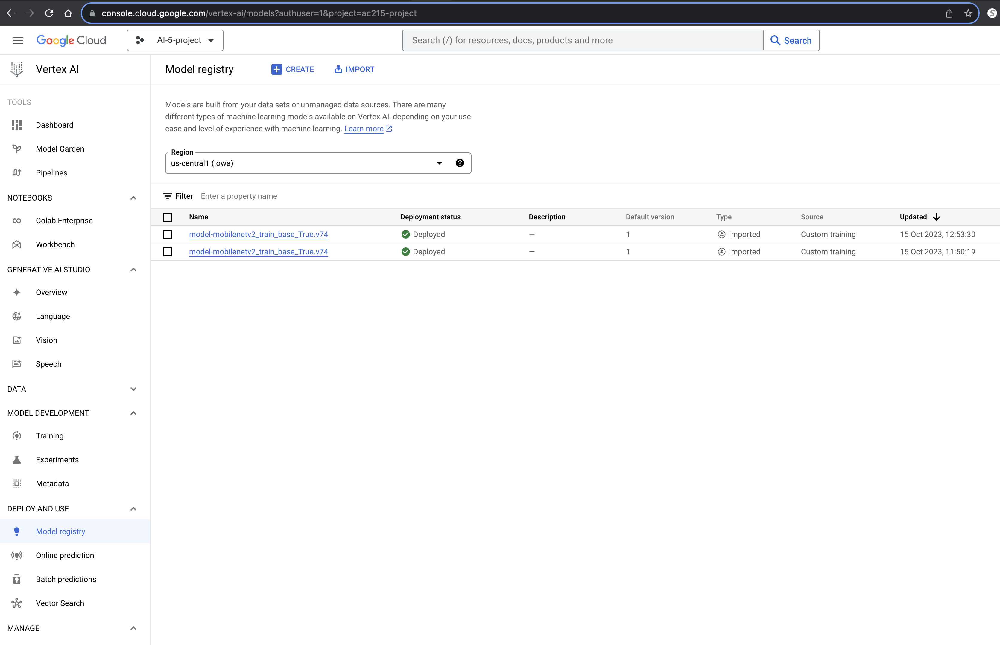
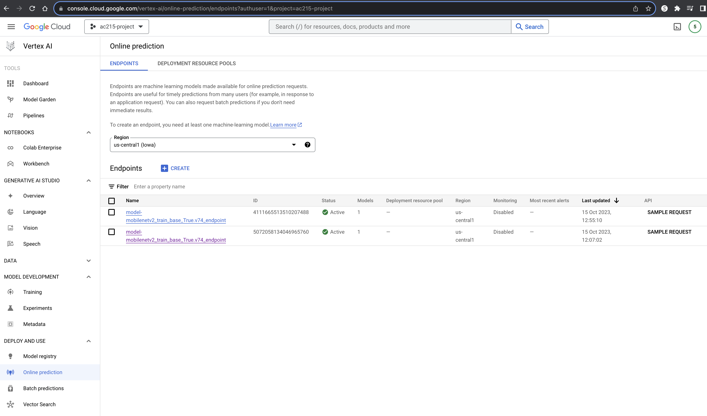
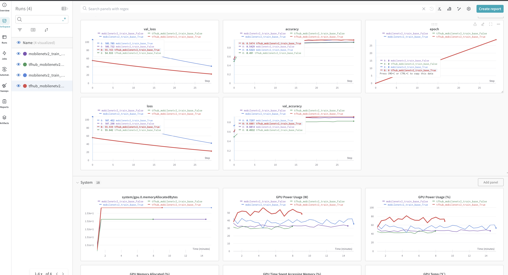
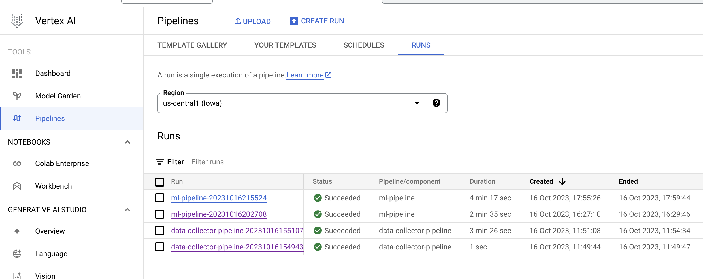
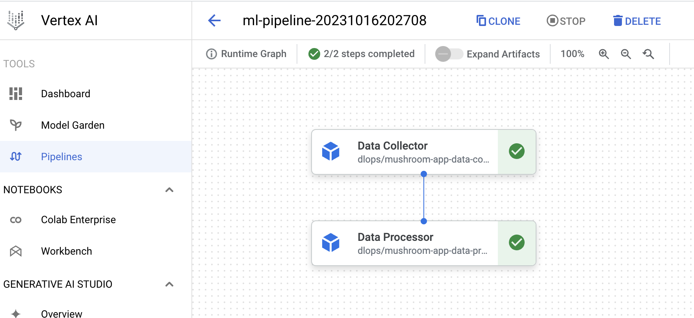

AI5-Template
==============================

AI5

Notes:

    The files are empty placeholders only
    Never commit large data files,trained models, personal API Keys/secrets to GitHub

Project Organization
------------

    .
    ├── data # DO NOT UPLOAD DATA
    │   ├── interim          <- Intermediate preprocessed data
    │   │   ├── test.csv
    │   │   ├── train.csv
    │   │   └── val.csv
    │   ├── processed        <- Final dataset files for modeling
    │   │   ├── file_00-0.tfrec
    │   │   ├── file_00-1.tfrec
    │   │   ├── file_00-2.tfrec
    │   │   └── file_00-3.tfrec
    │   └── raw              <- Original immutable input data
    │       └── training_data.zip
    ├── LICENSE
    ├── notebooks            <- Jupyter notebooks for EDA and model testing
    │   ├── eda.ipynb
    │   └── model_testing.ipynb
    ├── README.md
    ├── references           <- Reference materials such as papers
    ├── reports              <- Folder containing your milestone markdown submissions
    │   ├── milestone2.md
    │   └── milestone3.md
    │   └── milestone4.md
    ├── presentations        <- Folder containing your midterm presentation
    │   └── midterm.pdf
    ├── requirements.txt
    ├── src                  <- Source code and Dockerfiles for data processing and modeling
    │   ├── datapipeline     <- Scripts for dataset creation
    │   │   ├── build_records.py
    │   │   ├── dataloader.py
    │   │   ├── Dockerfile
    │   │   ├── process.py
    │   │   ├── Pipfile.lock
    │   │   └── Pipfile
    │   └── models           <- Model training, evaluation, and prediction code
    │       └── vgg16
    │           ├── Dockerfile
    │           ├── Pipfile
    │           ├── Pipfile.lock
    │           └── train_multi_gpu.py
    │       └── vgg16_pruning
    │           ├── Dockerfile
    │           ├── Pipfile
    │           ├── Pipfile.lock
    │           └── train_multi_gpu.py
    │   ├── workflow     <- Scripts for automating data collection, preprocessing, modeling
    │   │   ├── cli.py
    │   │   ├── pipeline.yaml
    │   │   ├── Dockerfile
    │   │   ├── docker-entrypoint.sh
    │   │   ├── docker-shell.sh
    │   │   ├── Pipfile
    │   │   └── Pipfile.lock
    └── test_project.py

--------

# AI5 - Milestone4 - ButterFlyer

**Team Members**
Pavlov Protovief, Paolo Primopadre and Pablo El Padron

**Group Name**
Awesome Group

**Project**
In this project we aim to develop an application that can identify various species of butterflies in the wild using computer vision and offer educational content through a chatbot interface.

### Milestone4

We incorporated workflow orchestration into our project with the use of [Vertex AI Pipelines](https://cloud.google.com/vertex-ai/docs/pipelines). In order to utilize this tool, we created a script that specifies the directed acyclic graph (DAG) for calling the data collection, data preprocessing, and modeling tasks, as well as how to run each of these tasks. Finally, the script ships our code off to Vertex AI Pipelines, which runs each of our tasks in the order we specified.

Regarding the modeling process, we wanted to see if we could utilize a compression technique that allowed us to get similar accuracy to our VGG16 performance with considerably fewer weights. Our goal was to decrease training time in order to improve development turnaround time, as well as reduce latency when we eventually deploy our model in our web application. 

**Vertex AI Pipelines**

Below you can see two images related to our work with Vertex AI Pipelines. The first showcases our models which we've saved within the Vertex AI *Model Registry*, and the second is our *Endpoints*, which are our models that are available for model prediction requests. 

**Compression Model**

Below you can see our Weights & Biases page while training our compression model

#### Code Structure

**Data Folder**
`Don't submit data, but we wanted to show one possible way of structuring data transformations.`

**Data Processing Container**

- This container reads 100GB of data, transforming the images to TFRecords and stores them on a GCP bucket
- Input to this container is source and destination GCS location, parameters for resizing, secrets needed - via docker
- Output from this container stored on GCP bucket

(1) `src/datapipeline/dataloader.py`  - This script loads the original immutable data to our compute instance's local `raw` folder for processing.

(2) `src/datapipeline/build_records.py`  - Loads a local copy of the dataset, processes it according to our new transformations, converts it to TFRecords, and pushes it to a GCP bucket sink.

(3) `src/preprocessing/Dockerfile` - This dockerfile starts with  `python:3.8-slim-buster`. This <statement> attaches volume to the docker container and also uses secrets (not to be stored on GitHub) to connect to GCS.

To run Dockerfile - `Instructions here`

**VGG16 Training Container**

- This container contains all our training scripts and modeling components. It will use data from a GCP bucket, train, and then output model artifacts (saved model) to a GCP bucket.
- The input for this container is the source bucket for our training data and the output bucket for storing the trained model.
- Output is a saved TF Keras model.

(1) `src/models/vgg16/train_multi_gpu.py` - This script converts incoming data to TFRecords, applies standard image augmentation, and fits the model. It takes the following arguments:

> > --gpu [int] : the number of GPUs to use for training, default is 1
> > --input [string] : the source of the training data
> > --output [string] : the bucket which to store model artifacts

(3) `src/models/vgg16/Dockerfile` - This dockerfile starts with  `python:3.8-slim-buster`. This <statement> attaches volume to the docker container and also uses secrets (not to be stored on GitHub) to connect to GCS.

**VGG16 Pruning Container**

This container has a very similar structure to that of the *VGG16 Training Container* mentioned above, with the main difference being the incorporation of the pruning compression technique.

Below, you will see the difference in model size, parameters, performance, and a detailed description of why we chose this pruning technique and what lessons we learned:
`Image(s) and detailed explanation(s) here`

**Workflow Orchestration Container**

- This container will be used to build pipelines that run in Vertex AI. 
- Pipelines can be orchestrated using Kubeflow Pipelines Python SDK ([kfp](https://www.kubeflow.org/docs/components/pipelines/v1/sdk/sdk-overview/)). 
- This container will have a CLI to submit the pipeline to Vertex AI in GCP.

(1) `src/workflow/cli.py`  - The CLI to test creation and execution of pipelines.

(2) `src/workflow/pipeline.yaml`  - The generated pipeline definition file. 

(3) `src/workflow/Dockerfile` - This Dockerfile holds all the instruction to re-create an environemnt with all Google Cloud SDKs to enable us to connect with Vertext AI in GCP.

(4) `src/workflow/Pipfile` - Contains all the python dependencies required

`Image(s) and summary explanation(s) here on how each component of the pipeline works`

**Dockerfile Instructions**
To run Dockerfile - `Instructions here`

**Notebooks** 
This folder contains code that is not part of container - for e.g: EDA, any 🔍 🕵️‍♀️ 🕵️‍♂️ crucial insights, reports or visualizations. 
